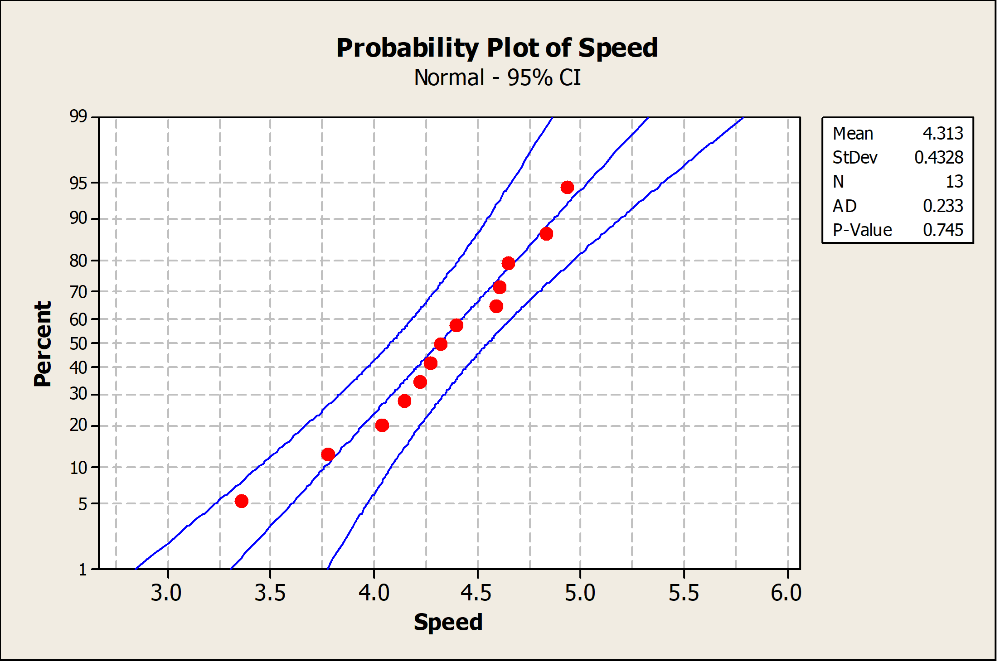

<h1 align="center">06 Statistical Intervals</h1>

### Session Preparation:
ASPE: 8 (not 8.6)

Solve the [exercises from session 5](https://rbrooksdk.github.io/SMP1_25/05_Point_Estimation_and_sampling/#exercises) before class.

### Session Material

[Recap notes](https://drive.google.com/file/d/10xgGtMHdRsu2p9ISkxM1I0RY6_Dah-fx/view?usp=sharing)

[Session Notes](https://drive.google.com/file/d/1TsK3ewuI5jNF6JuT4Yg1Y3JP85F5OZAI/view?usp=sharing)

[Session material](https://viaucdk-my.sharepoint.com/:f:/g/personal/rib_viauc_dk/EoY5rMCapgZLjtOdxkhvvVoBh_QnTKnGGcTPPM5vjoHd4w?e=Itlujg)

Session from 20/21: 
<iframe width="560" height="315" src="https://www.youtube.com/embed/lY7hLitDi-U?si=yLkFWoPkzkZFuSk2" title="YouTube video player" frameborder="0" allow="accelerometer; autoplay; clipboard-write; encrypted-media; gyroscope; picture-in-picture; web-share" referrerpolicy="strict-origin-when-cross-origin" allowfullscreen></iframe>

### Session Description

Statistical intervals are a way of expressing the uncertainty associated with a statistical estimate. They provide a range of values within which the true value of a population parameter or a future observation is likely to fall, based on a sample of data. Confidence intervals estimate the value of a population parameter with a measure of uncertainty, while prediction intervals provide a range of values for a future observation, taking into account both the uncertainty associated with estimating the population parameter and the variability associated with predicting individual observations. Statistical intervals are commonly used in various fields to estimate population parameters or future outcomes with a measure of precision and reliability.

#### Key Concepts
- CI for mean
- CI for proportion
- CI for variance
- Tolerance and prediction interval

---

### Exercises
The first five exercises are from today’s topics. Do these first. The rest is a bit of everything, including
covariance and correlation which we did not do exercises in yet.

Full solutions to the book exercises (1-5) can be found in the [general resource folder](https://viaucdk-my.sharepoint.com/:f:/g/personal/rib_viauc_dk/Egbdbeb9oy1Oqk8hReXf2-wBibryPlLiVj2ujGdsvH5--w?e=liO02A)

Note, sometimes we use '$=$' instead of '$\approx$' when we state probabilities with a given decimal precision.

#### Exercise 1 (Book 8.1.7)
A manufacturer produces piston rings for an automobile engine. It is known that ring diameter is normally distributed with $\sigma=0.001$ millimeters. A random sample of 15 rings has a mean diameter of $\bar{x}=74.036$ millimeters.

1. Construct a $99 \%$ two-sided confidence interval on the mean piston ring diameter.
2. Construct a $99 \%$ lower-confidence bound on the mean piston ring diameter. Compare the lower bound of this confidence interval with the one in part (a).

??? answer
    1. $99 \%$ Two-sided CI on the true $m$ ean piston ring diam eter
    For $\alpha=0.01, z_{\alpha / 2}=20.005=2.58$, and $\bar{x}=74.036, \sigma=0.001, n=15$

        $$
        \begin{gathered}
        \bar{x}-z_{0005}\left(\frac{\sigma}{\sqrt{n}}\right) \leq \mu \leq \bar{x}+z_{0.00 s}\left(\frac{\sigma}{\sqrt{n}}\right) \\
        74.036-2.58\left(\frac{0.001}{\sqrt{15}}\right) \leq \mu \leq 74.036+2.58\left(\frac{0.001}{\sqrt{15}}\right) \\
        74.0353 \leq \mu \leq 74.0367
        \end{gathered}
        $$

    2. $99 \%$ One-sided CI on the true $m$ ean piston ring diam eter
    For $\alpha=0.01, z_a=z_{0.01}=2.33$ and $\bar{x}=74.036, \sigma=0.001, n=15$

        $$
        \begin{aligned}
        & x-z_{0.01} \frac{\sigma}{\sqrt{n}} \leq \mu \\
        & 74.036-2.33\left(\frac{0.001}{\sqrt{15}}\right) \leq \mu \\
        & 74.03574 \leq \mu
        \end{aligned}
        $$

#### Exercise 2 (Book 8.1.8)
A civil engineer is analyzing the compressive strength of concrete. Compressive strength is normally distributed with $\sigma^2=1000(\mathrm{psi})^2$. A random sample of 12 specimens has a mean compressive strength of $\bar{x}=3250$ psi.

1. Construct a $95 \%$ two-sided confidence interval on mean compressive strength.
2. Construct a $99 \%$ two-sided confidence interval on mean compressive strength. Compare the width of this confidence interval with the width of the one found in part (a).

??? answer
    1. $95 \%$ two sided CI on the $m$ ean com pressive strength

        $$
        \begin{aligned}
        & z_{\alpha / 2}=z_{0.025}=1.96, \text { and } \bar{x}=3250, \sigma^2=1000, n=12 \\
        & \overline{\bar{x}}-z_{0.025}\left(\frac{\sigma}{\sqrt{n}}\right) \leq \mu \leq \bar{x}+z_{0.025}\left(\frac{\sigma}{\sqrt{n}}\right) \\
        & 3250-1.96\left(\frac{31.62}{\sqrt{12}}\right) \leq \mu \leq 3250+1.96\left(\frac{31.62}{\sqrt{12}}\right) \\
        & 3250-17.89 \leq \mu \leq 3250+17.89 \\
        & 3232.11 \leq \mu \leq 3267.89
        \end{aligned}
        $$

    2. $99 \%$ Two-sided CI on the true $m$ ean com pressive strength

        $$
        \begin{aligned}
        z_{\alpha / 2}= & z_{0.005}= \\
        & 2.58 \\
        \bar{x} & -z_{0.005}\left(\frac{\sigma}{\sqrt{n}}\right) \leq \mu \leq \bar{x}+z_{0.005}\left(\frac{\sigma}{\sqrt{n}}\right)
        \end{aligned}
        $$

#### Exercise 3 (Book 8.2.10)
An article in Computers & Electrical Engineering ["Parallel Simulation of Cellular Neural Networks" (1996, Vol. 22, pp. 61-84)] considered the speedup of cellular neural networks (CNNs) for a parallel general-purpose computing architecture based on six transputers in different areas. The data follow:

| 3.775302 | 3.350679 | 4.217981 | 4.030324 | 4.639692 |
| :--- | :--- | :--- | :--- | :--- |
| 4.139665 | 4.395575 | 4.824257 | 4.268119 | 4.584193 |
| 4.930027 | 4.315973 | 4.600101 |  |  |

1. Is there evidence to support the assumption that speedup of CNN is normally distributed? Include a graphical display in your answer.
2. Construct a $95 \%$ two-sided confidence interval on the mean speedup.
3. Construct a $95 \%$ lower confidence bound on the mean speedup.

??? answer
    1. The data appear to be normally distributed based on examination of the normal probability plot below.
        

            
        

    2. $95 \%$ confidence interval on mean speed-up

        $$
        \begin{aligned}
        & n=13 \quad \bar{x}=4.313 \quad s=0.4328 \quad t_{0.025,12}=2.179 \\
        & \bar{x}-t_{0.025,12}\left(\frac{s}{\sqrt{n}}\right) \leq \mu \leq \bar{x}+t_{0.025,12}\left(\frac{s}{\sqrt{n}}\right) \\
        & 4.313-2.179\left(\frac{0.4328}{\sqrt{13}}\right) \leq \mu \leq 4.313+2.179\left(\frac{0.4328}{\sqrt{13}}\right) \\
        & 4.051 \leq \mu \leq 4.575
        \end{aligned}
        $$

    3. $95 \%$ lower confidence bound on mean speed-up

        \begin{aligned}
        & n=13 \quad \bar{x}=4.313 \quad s=0.4328 \quad t_{0.05,12}=1.782 \\
        & \bar{x}-t_{0.05,12}\left(\frac{s}{\sqrt{n}}\right) \leq \mu \\
        & 4.313-1.782\left(\frac{0.4328}{\sqrt{13}}\right) \leq \mu \\
        & 4.099 \leq \mu
        \end{aligned}

#### Exercise 4 (Book 8.3.5)
An article in Technometrics ["Two-Way Random Effects Analyses and Gauge R\&R Studies" (1999, Vol. 41(3), pp. 202-211)] studied the capability of a gauge by measuring the weight of paper. The data for repeated measurements of one sheet of paper are in the following table. Construct a $95 \%$ one-sided upper confidence interval for the standard deviation of these measurements. Check the assumption of normality of the data and comment on the assumptions for the confidence interval.

| Observations |  |  |  |  |
| :--- | :--- | :--- | :--- | :--- |
| 3.481 | 3.448 | 3.485 | 3.475 | 3.472 |
| 3.477 | 3.472 | 3.464 | 3.472 | 3.470 |
| 3.470 | 3.470 | 3.477 | 3.473 | 3.474 |

??? answer
    $95 \%$ confidence interval for $\sigma$

    $$
    \begin{aligned}
    n=15 \quad s=0.00831 \\
    \chi_{1-\alpha, n-1}^2 & =\chi_{0.95,14}^2=6.53 \\
    \sigma^2 & \leq \frac{14(0.00831)^2}{6.53} \\
    \sigma^2 & \leq 0.000148 \\
    \sigma & \leq 0.0122
    \end{aligned}
    $$

    The data do not appear to be normally distributed based on an examination of the normal probability plot below. Therefore, the $95 \%$ confidence interval for $\sigma$ is not valid.

#### Exercise 5 (Book 8.4.1)
The 2004 presidential election exit polls from the critical state of Ohio provided the following results. The exit polls had 2020 respondents, 768 of whom were college graduates. Of the college graduates, 412 voted for George Bush.

1. Calculate a $95 \%$ confidence interval for the proportion of college graduates in Ohio who voted for George Bush.
2. Calculate a $95 \%$ lower confidence bound for the proportion of college graduates in Ohio who voted for George Bush.

??? answer
    1. $95 \%$ confidence interval for the proportion of college graduates in Ohio that voted for George Bush.

        $$
        \begin{gathered}
        \hat{p}=\frac{412}{768}=0.536 \quad n=768 z_{\alpha / 2}=1.96 \\
        \hat{p}-z_{\alpha / 2} \sqrt{\frac{\hat{p}(1-\hat{p})}{n}} \leq p \leq \hat{p}+z_{\alpha / 2} \sqrt{\frac{\hat{p}(1-\hat{p})}{n}} \\
        0.536-1.96 \sqrt{\frac{0.536(0.464)}{768}} \leq p \leq 0.536+1.96 \sqrt{\frac{0.536(0.464)}{768}} \\
        0.501 \leq p \leq 0.571
        \end{gathered}
        $$

    2. $95 \%$ lower confidence bound on the proportion of college graduates in Ohio that voted for George Bush.

        $$
        \begin{aligned}
        \hat{p}-z_\alpha \sqrt{\frac{\hat{p}(1-\hat{p})}{n}} & \leq p \\
        0.536-1.645 \sqrt{\frac{0.536(0.464)}{768}} & \leq p \\
        0.506 & \leq p
        \end{aligned}
        $$

#### Exercise 6
Let $X$ be a continuous random variable with PDF

$$
f_X(x)= \begin{cases}\frac{5}{32} x^4 & 0 \leq x \leq 2 \\ 0 & \text { otherwise }\end{cases}
$$

and let $Y=X^2$.

1. Find CDF of $Y$.
2. Find PDF of $Y$.
3. Find $E Y$.
??? answer
    1. $$F_Y(y)=\left\{\begin{array}{lc}
    0 & \text { for } y<0 \\
    \frac{1}{32} y^2 \sqrt{y} & \text { for } 0 \leq y \leq 4 \\
    1 & \text { for } y>4
    \end{array}\right.$$
    2. $$ f_Y(y)=F_Y^{\prime}(y)= \begin{cases}\frac{5}{64} y \sqrt{y} & \text { for } 0 \leq y \leq 4 \\ 0 & \text { otherwise }\end{cases}$$
    3. $$ E Y=\frac{20}{7} $$

#### Exercise 7
Consider two random variables $X$ and $Y$ with joint PMF given in the Table

|  | $Y=0$ | $Y=1$ | $Y=2$ |
| :---: | :---: | :---: | :---: |
| $X=0$ | $\frac{1}{6}$ | $\frac{1}{4}$ | $\frac{1}{8}$ |
| $X=1$ | $\frac{1}{8}$ | $\frac{1}{6}$ | $\frac{1}{6}$ |

1. Find $\operatorname{Cov}(X, Y)$
2. Find $\rho(X, Y)$
??? answer
    1. \(\operatorname{Cov}(X, Y)=\frac{1}{24}\)
    2. \(\rho(X, Y)\approx 0.11\)

#### Exercise 8
Let $X$ and $Y$ be two independent $N(0,1)$ random variables and

$$
\begin{aligned}
& Z=11-X+X^2 Y \\
& W=3-Y
\end{aligned}
$$

Find $\operatorname{Cov}(Z, W)$.

??? answer
    $$\operatorname{Cov}(Z, W)=-1$$

#### Exercise 9
Let $X$ be a continuous random variable with PDF

$$
f_X(x)= \begin{cases}x^2+\frac{2}{3} & 0 \leq x \leq 1 \\ 0 & \text { otherwise }\end{cases}
$$

1. Find $E\left(X^n\right)$, for $n=1,2,3, \cdots$. Note, you must find an expression involving $n$.
2. Find variance of $X$.

??? answer
    1. $$E\left[X^n\right]=\frac{5 n+9}{3(n+1)(n+3)} . \quad \text { where } n=1,2,3, \cdots $$
    2. $$\operatorname{Var}(X)=0.0819$$

#### Exercise 10
Challenge Exercise. I have solutions, but did anyone solve it?
The following exercise comes from the 2020 exam in the 10 ECTS course in Probability Theory and Stochastic Modelling at Aarhus University taken by students of Math, Data Science and Computer Science (i.e. not the course taken by Engineers that is similar to SMP). That is, this exercise is one level above the level of the SMP course. The assignment had a weighting of $30 \%$ of the total exam which is a 4 hour written exam. These students are, however, expected to state all relevant calculations (i.e. not just use solve or sp.integrate). Naturally, you should use these tool. But if you are able to do this type of assignment, in about an hour or so, things are looking bright for you.

Let $X$ denote the stochastic variable with the following PDF:

$$
f_X(x)= \begin{cases}\frac{3}{8} x^2 & 0<x<2 \\ 0 & \text { otherwise }\end{cases}
$$

1. Find $P(X>3 / 4)$ and $P(X<3 / 4)$.
2. Find $E[(X+2) / 3]$ and $E\left[X^2\right]$
3. Let $Z=e^{2 X}$ and find the probability density function of $Z$ for all $z \in \mathbb{R}$.

Let $Y$ denote the stochastic variable that is independent to $X$ and has the distribution as $X$, i.e. $Y$ has the following PDF:

$$
f_Y(y)= \begin{cases}\frac{3}{8} y^2 & 0<y<2 \\ 0 & \text { otherwise }\end{cases}
$$

4. Find $\operatorname{Cov}(2 X+3 Y, X-4 Y+9)$.
5. Find $P(X \cdot Y<1)$.