<h1 align="center">07 Hypothesis Testing</h1>

## Material:
ASPE: 9.1-9.3 + 9.5 + 9.8 + 10.1-10.4 + 10.6

[Notes recap](https://drive.google.com/file/d/1KR85vvK9Oo_QN9WKiHic2bY3ueC3JShL/view?usp=sharing)

[Session notes](https://drive.google.com/file/d/1fg4pstQXTtnNDVbvgWSEwN-CucDAx7Nt/view?usp=sharing)

[Session material](https://viaucdk-my.sharepoint.com/:f:/g/personal/rib_viauc_dk/Em4S0kBQDWZPiOBLpJjM3MEBNWQx40JCmPXPRtj0EoO7_g?e=VFim27)

Session from 20/21: 

<iframe width="560" height="315" src="https://www.youtube.com/embed/B1W0U1gzYE8?si=ACPYCDQS-PqVAzG8" title="YouTube video player" frameborder="0" allow="accelerometer; autoplay; clipboard-write; encrypted-media; gyroscope; picture-in-picture; web-share" referrerpolicy="strict-origin-when-cross-origin" allowfullscreen></iframe>

---

### Session Description

Hypothesis testing is a statistical method used to evaluate whether a certain hypothesis about a population parameter is supported by the data. The key elements of hypothesis testing include the formulation of a null hypothesis and an alternative hypothesis, the selection of an appropriate test statistic, the determination of a significance level or alpha value, the calculation of a p-value, and the comparison of the p-value to the significance level to decide whether to reject or fail to reject the null hypothesis. The significance level is a pre-determined threshold that represents the maximum probability of observing the data if the null hypothesis is true, and the p-value is the probability of observing the data, or more extreme data, if the null hypothesis is true. Hypothesis testing is widely used in many fields to make inferences about population parameters based on sample data, and it is an essential tool for scientific research and decision-making.

#### Key Concepts
- Basics of hypothesis testing
- Type I and II errors
- P-values and critical values and test statistic
- Tests on mean and proportion
- One and two tailed tests
- Paired t-test
- Contingency table tests (next time in recap)

---

### Exercises

<!-- ASPE: 9.3.8 + 9.3.9 + 9.5.3 + 9.5.4 -->
<!-- Exam 2014.2.c; 2015.3; 2015.4; 2016.4; 2017.5; Reexam 2018.4 (not g) -->

#### Exercise 1 (Book 9.3.8)

Cloud seeding has been studied for many decades as a weather modification procedure (for an interesting study of this subject, see the article in Technometrics, "A Bayesian Analysis of a Multiplicative Treatment Effect in Weather Modification," 1975 , Vol. 17, pp. 161-166). The rainfall in acre-feet from 20 clouds that were selected at random and seeded with silver nitrate follows: $18.0,30.7,19.8,27.1,22.3,18.8,31.8,23.4$, $21.2,27.9,31.9,27.1,25.0,24.7,26.9,21.8,29.2,34.8,26.7$, and 31.6.

1. Can you support a claim that mean rainfall from seeded clouds exceeds 25 acre-feet? Use $\alpha=0.01$. Find the $P$-value.
2. Check that rainfall is normally distributed.
3. Compute the power of the test if the true mean rainfall is 27 acre-feet.
4. What sample size would be required to detect a true mean rainfall of 27.5 acre-feet if you wanted the power of the test to be at least 0.9 ?
5. Explain how the question in part (a) could be answered by constructing a one-sided confidence bound on the mean diameter.

??? answer
    1.     
        1) The parameter of interest is the true mean rainfall, $\mu$.

        2) $H_0: \mu = 25$ 

        3) $H_1: \mu > 25$.

        4) $\mathrm{t}_0=\frac{\bar{x}-\mu}{s / \sqrt{n}}$
        
        5) Reject $\mathrm{H}_0$ if $\mathrm{t}_0>\mathrm{t}_{\alpha, \mathrm{n}-1}$ where $\alpha=0.01$ and $\mathrm{t}_{0.01,19}=2.539$ for $\mathrm{n}=20$
        
        6) $\overline{\mathrm{x}}=26.04 \mathrm{~s}=4.78 \mathrm{n}=20$

        $$
        \mathrm{t}_0=\frac{26.04-25}{4.78 / \sqrt{20}}=0.97
        $$

        7) Because $0.97<2.539$ fail to reject the null hypothesis. There is insufficient evidence to conclude that the true mean rainfall is greater than 25 acre-feet at $\alpha=0.01$. The $0.10<\mathrm{P}$-value $<0.25$.

    2. The data on the normal probability plot falls along a line. Therefore, the normality assumption is reasonable.

        

            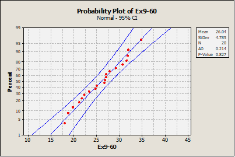
        

    3. $d=\frac{\delta}{\sigma}=\frac{\left|\mu-\mu_0\right|}{\sigma}=\frac{|27-25|}{4.78}=0.42$

        Using the OC curve, Chart VII h) for $\alpha=0.01, \mathrm{~d}=0.42$, and $\mathrm{n}=20$, obtain $\beta \cong 0.7$ and power of $1-0.7=$ 0.3 .
    
    4. $d=\frac{\delta}{\sigma}=\frac{\left|\mu-\mu_0\right|}{\sigma}=\frac{|27.5-25|}{4.78}=0.52$

        Using the OC curve, Chart VII h) for $\alpha=0.01, \mathrm{~d}=0.52$, and $\beta \cong 0.1$ (Power=0.9), $\mathrm{n}=75$    
    
    5. $99 \%$ lower confidence bound on the mean diameter

        $$
        \begin{aligned}
        & \bar{x}-t_{0.01,19}\left(\frac{s}{\sqrt{n}}\right) \leq \mu \\
        & 26.04-2.539\left(\frac{4.78}{\sqrt{20}}\right) \leq \mu \\
        & 23.326 \leq \mu
        \end{aligned}
        $$

        Because the lower limit of the CI is less than 25 there is insufficient evidence to conclude that the true mean rainfall is greater than 25 acre-feet at $\alpha=0.01$.
        

#### Exercise 2 (Book 9.3.9)

A 1992 article in the Journal of the American Medical Association ("A Critical Appraisal of 98.6 Degrees F, the Upper Limit of the Normal Body Temperature, and Other Legacies of Carl Reinhold August Wunderlich") reported body temperature, gender, and heart rate for a number of subjects. The body temperatures for 25 female subjects follow: $97.8,97.2$, $97.4,97.6,97.8,97.9,98.0,98.0,98.0,98.1,98.2,98.3,98.3$, $98.4,98.4,98.4,98.5,98.6,98.6,98.7,98.8,98.8,98.9,98.9$, and 99.0.

1. Test the hypothesis $H_0: \mu=98.6$ versus $H_1: \mu \neq 98.6$, using $\alpha=0.05$. Find the $P$-value.
2. Check the assumption that female body temperature is normally distributed.
3. Compute the power of the test if the true mean female body temperature is as low as 98.0 .
4. What sample size would be required to detect a true mean female body temperature as low as 98.2 if you wanted the power of the test to be at least 0.9 ?
5. Explain how the question in part (a) could be answered by constructing a two-sided confidence interval on the mean female body temperature.

??? answer
    1.     
        1) The parameter of interest is the true mean female body temperature, $\mu$.
        
        2) $H_0: \mu = 98.6$
        
        3) $H_1: \mu \neq 98.6$.
        
        4) $t_0=\frac{\bar{x}-\mu}{s / \sqrt{n}}$
        
        5) Reject $\mathrm{H}_0$ if $\left|\mathrm{t}_0\right| \geq \mathrm{t}_{\alpha / 2, \mathrm{n}-1} \quad$ where $\alpha=0.05$ and $\mathrm{t}_{\alpha / 2, \mathrm{n}-1}=2.064$ for $\mathrm{n}=25$
        
        6) $\bar{x}=98.264, \mathrm{~s}=0.4821, \mathrm{n}=25$

        $$
        t_0=\frac{98.264-98.6}{0.4821 / \sqrt{25}}=-3.48
        $$

        7) Because $3.48>2.064$, reject the null hypothesis. Conclude that the true mean female body temperature differs from $98.6^{\circ} \mathrm{F}$ at $\alpha=0.05$.

        $$
        P \text {-value }=2(0.001)=0.002
        $$

    2. The data on the normal probability plot falls along a line. The normality assumption is reasonable.

        

            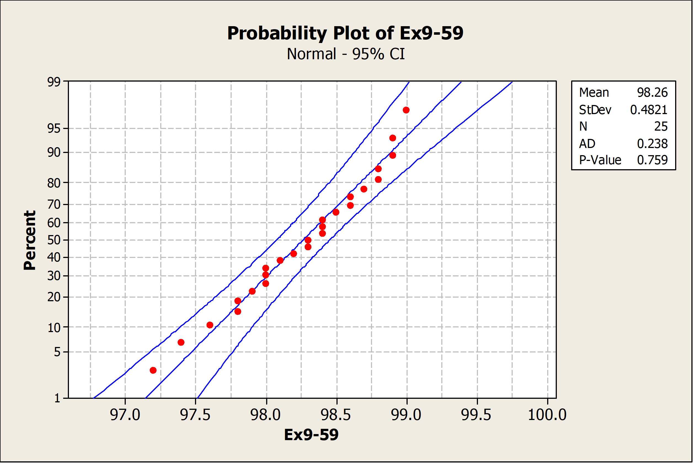
        

    3. $d=\frac{\delta}{\sigma}=\frac{\left|\mu-\mu_0\right|}{\sigma}=\frac{|98-98.6|}{0.4821}=1.24$

        Using the OC curve, Chart VIIe for $\alpha=0.05, \mathrm{~d}=1.24$, and $\mathrm{n}=25$, obtain $\beta \cong 0$ and power of $1-0 \cong 1$
    4. $d=\frac{\delta}{\sigma}=\frac{\left|\mu-\mu_0\right|}{\sigma}=\frac{|98.2-98.6|}{0.4821}=0.83$

        Using the OC curve, Chart VIIe for $\alpha=0.05, \mathrm{~d}=0.83$, and $\beta \cong 0.1$ (Power=0.9), $\mathrm{n}=20$
    
    5. 
    
        $95 \%$ two sided confidence interval

        $$
        \begin{aligned}
        \bar{x}-t_{0.025,24}\left(\frac{s}{\sqrt{n}}\right) & \leq \mu \leq \bar{x}+t_{0.025,24}\left(\frac{s}{\sqrt{n}}\right) \\
        98.264-2.064\left(\frac{0.4821}{\sqrt{25}}\right) & \leq \mu \leq 98.264+2.064\left(\frac{0.4821}{\sqrt{25}}\right) \\
        98.065 & \leq \mu \leq 98.463
        \end{aligned}
        $$

        We conclude that the mean female body temperature differs from 98.6 at $\alpha=0.05$ because the value is not included inside the confidence interval.

#### Exercise 3 (Book 9.5.3)

An article in the British Medical Journal ["Comparison of Treatment of Renal Calculi by Operative Surgery, Percutaneous Nephrolithotomy, and Extra-Corporeal Shock Wave Lithotripsy" (1986, Vol. 292, pp. 879-882)] repeated that percutaneous nephrolithotomy (PN) had a success rate in removing kidney stones of 289 of 350 patients. The traditional method was $78 \%$ effective.

1. Is there evidence that the success rate for PN is greater than the historical success rate? Find the $P$-value.
2. Explain how the question in part (a) could be answered with a confidence interval.

??? answer
     1.     
        1) The parameter of interest is the true success rate
            
        2) $\mathrm{H}_0: p=0.78$
            
        3) $\mathrm{H}_1: p>0.78$
            
        4) $z_0=\frac{x-n p_0}{\sqrt{n p_0\left(1-p_0\right)}}$ or $z_0=\frac{\hat{p}-p_0}{\sqrt{\frac{p_0\left(1-p_0\right)}{n}}}$; Either approach will yield the same conclusion
            
        5) Reject $H_0$ if $\mathrm{z}_0>\mathrm{Z}_\alpha$. Since the value for $\alpha$ is not given. We assume $\alpha=0.05$ and $\mathrm{z}_\alpha=\mathrm{z}_{0.05}=1.65$
            
        6) 

        $x=289$ 

        $n=350$ 

        $\hat{p}=\frac{289}{350} \cong 0.83$

        $$
        z_0=\frac{x-n p_0}{\sqrt{n p_0\left(1-p_0\right)}}=\frac{289-350(0.78)}{\sqrt{350(0.78)(0.22)}}=2.06
        $$

        7) Because $2.06>1.65$, reject the null hypothesis and conclude the true success rate is greater than 0.78 at $\alpha=0.05$.

        $$
        \text { P-value }=1-0.9803=0.0197
        $$

    2. The $95 \%$ lower confidence interval:

        $$
        \begin{array}{r}
        \hat{p}-z_\alpha \sqrt{\frac{\hat{p}(1-\hat{p})}{n}} \leq p \\
        .83-1.65 \sqrt{\frac{0.83(0.17)}{350}} \leq p \\
        0.7969 \leq p
        \end{array}
        $$

        Because the hypothesized value is not in the confidence interval $(0.78<0.7969)$, reject the null hypothesis.

#### Exercise 4 (Book 9.5.4)

An article in Fortune (September 21, 1992) claimed that nearly one-half of all engineers continue academic studies beyond the B.S. degree, ultimately receiving either an M.S. or a Ph.D. degree. Data from an article in Engineering Horizons (Spring 1990) indicated that 117 of 484 new engineering graduates were planning graduate study.

1. Are the data from Engineering Horizons consistent with the claim reported by Fortune? Use $\alpha=0.05$ in reaching your conclusions. Find the $P$-value for this test.
2. Discuss how you could have answered the question in part (a) by constructing a two-sided confidence interval on $p$.

??? answer
    1.      
        1) The parameter of interest is the true proportion of engineering students planning graduate studies
        
        2) $\mathrm{H}_0: \mathrm{p}=0.50$
        
        3) $\mathrm{H}_1: \mathrm{p} \neq 0.50$
        
        4) $z_0=\frac{x-n p_0}{\sqrt{n p_0\left(1-p_0\right)}}$ or $z_0=\frac{\hat{p}-p_0}{\sqrt{\frac{p_0\left(1-p_0\right)}{n}}}$; Either approach will yield the same conclusion
        
        5) Reject $\mathrm{H}_0$ if $\mathrm{z}_0<-\mathrm{z}_{\alpha / 2}$ where $\alpha=0.05$ and $-\mathrm{z}_{\alpha / 2}=-\mathrm{z}_{0.025}=-1.96$ or $\mathrm{z}_0>\mathrm{z}_{\alpha / 2}$ where $\alpha=0.05$ and $\mathrm{z}_{\alpha / 2}=$ $\mathrm{z}_{0.025}=1.96$
        
        6) $\mathrm{x}=117 \mathrm{n}=484$

        $$
        \begin{aligned}
        & \hat{p}=\frac{117}{484}=0.2417 \\
        & z_0=\frac{x-n p_0}{\sqrt{n p_0\left(1-p_0\right)}}=\frac{117-484(0.5)}{\sqrt{484(0.5)(0.5)}}=-11.36
        \end{aligned}
        $$

        7) Because $-11.36>-1.65$ reject the null hypothesis and conclude that the true proportion of engineering students planning graduate studies differs from 0.5 , at $\alpha=0.05$.

        $$
        \text { P-value }=2[1-\Phi(11.36)] \cong 0
        $$

    2. $\hat{p}=\frac{117}{484}=0.2417 \approx 0.242$

        $$
        \begin{aligned}
        \hat{p}-z_{\alpha / 2} \sqrt{\frac{\hat{p}(1-\hat{p})}{n}} & \leq p \leq \hat{p}+z_{\alpha / 2} \sqrt{\frac{\hat{p}(1-\hat{p})}{n}} \\
        0.242-1.96 \sqrt{\frac{0.242(0.758)}{484}} & \leq p \leq 0.242-1.96 \sqrt{\frac{0.242(0.758)}{484}} \\
        0.204 & \leq p \leq 0.280
        \end{aligned}
        $$

        Because the $95 \%$ confidence interval does not contain the value 0.5 we conclude that the true proportion of engineering students planning graduate studies differs from 0.5.

#### Exercise 5 (Exam 2014.2.c)

An IT company receives its printed circuit boards from two different suppliers, 1 and 2. Records show that 5% 
of the circuit boards from supplier 1 and 3% of the circuit boards from supplier 2 are defective. 60% of the 
company’s current circuit boards come from supplier 2, and the remaining from supplier 1. The company 
usually keeps a stock of 2000 circuit boards.

1. Is there sufficient evidence to support the claim that the rate of defectives depends very significantly 
on supplier?

??? answer
    1.    
        $\mathrm{H}_0$ : Rate of defectives are independent of supplier

        $\mathrm{H}_1$ : Rate of defectives are dependent of supplier

        Level of significance $=0,01$

        P-value $= 0,0298$

        We fail to reject and conclude that we do not have sufficient evidence to support the claim that rate of defectives and suppliers are not very significantly independent .We would, however, be able to conclude this with alpha $=0,05$

#### Exercise 6 (Exam 2015.3)

Different screens and their hue bias were tested and the result is displayed in the following table:

|  | Blueish | Reddish | Greenish |
| :--- | :--- | :--- | :--- |
| Display 1 | 46 | 82 | 72 |
| Display 2 | 42 | 38 | 20 |
| Display 3 | 52 | 40 | 8 |

Is there sufficient evidence to conclude that screens and hue bias depend significantly?Design an appropriate 
test to answer this question.

??? answer
    $H_0$ : Screens and hue bias are independent

    $H_1$ : Screens and hue bias are dependent

    From the template, we obtain a p-value $= 0.0000$. From this we reject the null hypothesis and conclude that screens and hue bias are dependent.

#### Exercise 7 (Exam 2015.4)

Two different machines, $A$ and $B$, which are used to measure blood pressure, are tested on 12 different patients such that each patient has his/her blood pressure measured by both machines. The results for the systolic blood pressure are displayed in the table below:

| Patient | 1 | 2 | 3 | 4 | 5 | 6 | 7 | 8 | 9 | 10 | 11 | 12 |
| :---: | :---: | :---: | :---: | :---: | :---: | :---: | :---: | :---: | :---: | :---: | :---: | :---: |
| Machine   A | 119 | 130 | 141 | 123 | 149 | 156 | 134 | 108 | 123 | 138 | 119 | 156 |
| Machine   B | 112 | 126 | 145 | 112 | 138 | 156 | 130 | 112 | 112 | 119 | 112 | 152 |

1. Determine the mean, standard deviation and interquartile range for both sets of data
2. Is it possible to conclude with statistical significance that the two machines give different measurement? Design an appropriate test to answer this question.
3. Explain what the P -value obtained in b) actually means.

??? answer
    1.  

        |  | Machine A | Machine B |
        | :--- | ---: | ---: |
        |  | 119 | 112 |
        |  | 130 | 126 |
        |  | 141 | 145 |
        |  | 123 | 112 |
        |  | 149 | 138 |
        |  | 156 | 156 |
        |  | 134 | 130 |
        |  | 108 | 112 |
        |  | 123 | 112 |
        |  | 138 | 119 |
        |  | 119 | 112 |
        |  | 156 | 152 |
        | Mean | 133 | 127,16667 |
        | St. Dev. | 15,462565 | 16,813595 |
        | IQR | 21 | 27,75 |

    2. 

        $H_0$ : Mean machine A is equal to mean of machine B

        $H_1$ : Mean machine A is not equal to mean of machine B

        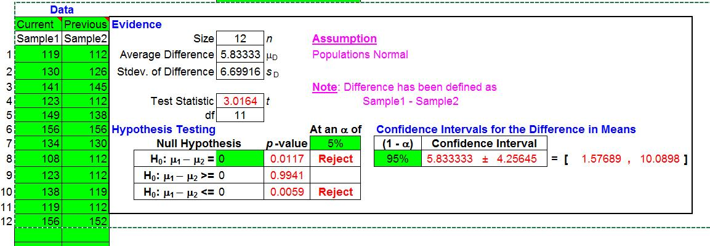

        We use a t-test since the samples are small. Also, the F-test shows that we are unable to reject 
        different variances and thus assume equal variance. We obtain a p-value $= 0,0117$. From this we 
        reject the null hypothesis and conclude that the machines are significantly different.

    3. The p-value indicates the probability of obtaining the samples given that the null hypothesis is true, i.e. under the assumption that the two machines yield similar measurements, the probability of obtaining the results from assignment a) is $0,0117$.

#### Exercise 8 (Exam 2016.4)

An industrial safety program was recently instituted in the computer chip industry. The average weekly loss (averaged over 1 month) in labor-hours due to accidents in 10 similar plants both before and after the program are as follows:

| Plant | Before | After |
| :--- | :--- | :--- |
| 1 | 30.5 | 23 |
| 2 | 18.5 | 21 |
| 3 | 24.5 | 22 |
| 4 | 32 | 28.5 |
| 5 | 16 | 14.5 |
| 6 | 15 | 15.5 |
| 7 | 23.5 | 24.5 |
| 8 | 25.5 | 21 |
| 9 | 28 | 23.5 |
| 10 | 18 | 16.5 |

1. Determine whether the safety program has had a significant effect on reducing labor-hours due to accidents in the 10 plants.
2. Setup a $95 \%$ confidence interval on the average difference and state how this interval could have been used to answer question a.
3. Is there evidence to support the claim that the program has had an effect at the $1 \%$ level of significance?

??? answer
    1. 
        
            Before = [30.5, 18.5, 24.5, 32, 16, 15, 23.5, 25.5, 28, 18]
            After = [23, 21, 22, 28.5, 14.5, 15.5, 24.5, 21, 23.5, 16.5]

            df = pd.DataFrame({'Before': Before,
                            'After': After})
            df['Difference'] = df['Before']- df['After']
            meandiff = np.mean(df['Difference'])

    
        We check for normality of the differences

            stats.probplot(df['Difference'], plot=plt)
            plt.ylabel('Difference in Labor-hours')
            plt.show()
            print('Skewness = ' + repr(round(stats.skew(df['Difference']),4)))
            print('Kurtosis = ' + repr(round(stats.kurtosis(df['Difference']),4)))
            fig, ax = plt.subplots()
            df['Difference'].plot.kde(ax=ax, legend=False, title='Distribution');

        

        Skewness = 0.1328

        Kurtosis = -0.7163

        

        Plotting

            n1 = len(df['Before'])
            SE1 = stats.sem(df['Before'])
            mean1 = np.mean(df['Before'])

            n2 = len(df['After'])
            SE2 = stats.sem(df['After'])
            mean2 = np.mean(df['After'])

            x1 = np.linspace(mean1-4*SE1, mean1+4*SE1, 1000)
            x2 = np.linspace(mean2-4*SE2, mean2+4*SE2, 1000)

            y1 = stats.t.pdf(x1, n1-1, mean1, SE1)
            y2 = stats.t.pdf(x2, n2-1, mean2, SE2)

            plt.plot(x1,y1, color='red')
            plt.plot(x2,y2, color='blue')

            plt.show()

        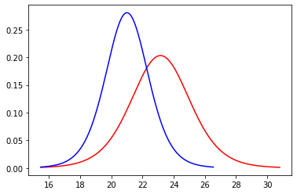

            val = stats.ttest_rel(df['Before'], df['After'])

            alpha = 0.05
            stat = abs(round(val[0],2))
            pvalue = round(val[1], 4)/2
            crit = abs(round(stats.t.ppf(alpha,n1-1),2))
            stat

        2.27

        if pvalue < alpha:
                print("Reject since " + repr(pvalue) + ' < ' + repr(alpha))
            else:
                print("Fail to reject since " + repr(pvalue) + ' > ' + repr(alpha))

        a) Reject since 0.02485 < 0.05

    2. same p-value different alpha, so no.

#### Exercise 9 (Exam 2017.5)

A recent study among 254 computer science graduates from Aarhus University was made in order to determine how successful the former students were in their current employment. 98 of these students had taken a course in linear algebra and of these 92 were classified as "successful" in their current employment. 136 of the students who had not taken a course in linear algebra were classified as "successful" in their current employment.

1. Is the evidence to support the claim that computer science graduates who had taken a linear algebra course were more successful in their current employment than those who had not taken such a course?
2. Explain the meaning of the p-value obtained in question (a), i.e. what does this probability refer to?

??? answer
    
        alg = 98
        algs = 92
        nonalgs = 136
        nonalg = 254-alg

    1. Since we have two proportions, we can use test of difference between proportions:

            val = sm.stats.proportions_ztest([algs, nonalgs], [alg, nonalg], value = None, alternative = 'larger')
            stat = abs(round(val[0],2))
            pvalue = round(val[1],4)

            alpha = 0.05
            crit = stats.norm.isf(alpha/2)

            if pvalue < alpha:
                print("Reject since " + repr(pvalue) + ' < ' + repr(alpha))
            else:
                print("Fail to reject since " + repr(pvalue) + ' > ' + repr(alpha))

        Reject since 0.0432 < 0.05

            import numpy as np
            from scipy.stats import norm
            from IPython.display import display, Markdown

            # Calculate the pooled proportion
            pooled_p = (algs + nonalgs) / (alg + nonalg)

            # Calculate the standard error
            std_error = np.sqrt(pooled_p * (1 - pooled_p) * (1/alg + 1/nonalg))

            # Calculate the z-score
            z_score = (algs/alg - nonalgs/nonalg) / std_error

            # Determine the p-value for the larger alternative
            p_value = norm.sf(z_score)  # sf is survival function, which is 1-cdf

            # Set significance level
            alpha = 0.05

            # Display the results
            display(Markdown(f"### Z-Test Results for Two Proportions"))
            display(Markdown(f"**Z-Score:** {z_score:.2f}"))
            display(Markdown(f"**P-Value:** {p_value:.4f}"))
            display(Markdown(f"**Significance Level (Alpha):** {alpha}"))

            # Decision based on p-value
            if p_value < alpha:
                display(Markdown("**Conclusion:** Reject the null hypothesis since p-value < alpha."))
            else:
                display(Markdown("**Conclusion:** Fail to reject the null hypothesis since p-value > alpha."))

        Z-Test Results for Two Proportions

        Z-Score: 1.71

        P-Value: 0.0432

        Significance Level (Alpha): 0.05

        Conclusion: Reject the null hypothesis since p-value < alpha.

            val[0]

        1.7143021919557946

    2. see other answers elsewhere
    
#### Exercise 10 (Reexam 2018.4)

Two producers of batteries measure the longevity of 30 batteries of the same type, which were randomly chosen from a larger batch of such batteries. The lifetime (in hundreds of hours) is displayed "Batteries.xlsx".

1. Check the dataset for outliers and replace any outliers with the mean lifetime of the producer in question. Use this cleaned dataset in the following questions.
2. Determine estimates for the quartiles, average lifetime, standard deviation and variance of each producer's battery
3. Setup $95 \%$ confidence intervals for each mean battery lifetime from the two producers, and accompany the intervals with plots that display the rejection region.
4. Is it reasonable to conclude that the lifetime of the two producer's battery follow a normal distribution? Explain using plots and discussing skewness and kurtosis.
5. Setup a $95 \%$ confidence interval for the difference between the two producer's battery, and accompany the intervals with plots that display the rejection region.
6. Is there significant evidence to support the claim that the mean lifetime of the batteries from the two producers differ from one another?

??? answer
    1. 

            df = pd.read_excel(
                'Batteries.xlsx'
            )
            df.head()

        |  | Producer 1 | Producer 2 |
        | :--- | ---: | ---: |
        | 0 | 2.1162 | 1.1259 |
        | 1 | 2.5135 | 3.1725 |
        | 2 | 1.8137 | 2.4492 |
        | 3 | 0.8075 | 3.7766 |
        | 4 | 1.5554 | 4.4673 |

            q3, q1 = np.percentile(df['Producer 1'], [75,25])
            iqr = q3 - q1
            upper = q3+1.5*iqr
            lower = q1 - 1.5*iqr
            average = df.loc[(df['Producer 1'] < upper) & (df['Producer 1'] > lower)  , 'Producer 1'].mean()
            df['Producer 1'] = np.where((df['Producer 1'] > upper) | (df['Producer 1'] < lower), average, df['Producer 1'])

            q3, q1 = np.percentile(df['Producer 2'], [75,25])
            iqr = q3 - q1
            upper = q3+1.5*iqr
            lower = q1 - 1.5*iqr
            average = df.loc[(df['Producer 2'] < upper) & (df['Producer 2'] > lower)  , 'Producer 2'].mean()
            df['Producer 2'] = np.where((df['Producer 2'] > upper) | (df['Producer 2'] < lower), average, df['Producer 2'])

    2. 

            df1 = df['Producer 1']
            df2 = df['Producer 2']

            print('Producer 1: ')
            print('q1 = ', round(df1.quantile(0.25), 4))
            print('q2 = ', round(df1.quantile(0.5), 4))
            print('q3 = ', round(df1.quantile(0.75), 4))
            print('q4 = ', round(df1.quantile(1), 4))
            print('average = ', round(df1.mean(), 4))
            print('std = ', round(df1.std(), 4))
            print('std = ', round(df1.var(), 4))
            print(' ')
            print('Producer 2: ')
            print('q1 = ', round(df2.quantile(0.25), 4))
            print('q2 = ', round(df2.quantile(0.5), 4))
            print('q3 = ', round(df2.quantile(0.75), 4))
            print('q4 = ', round(df2.quantile(1), 4))
            print('average = ', round(df2.mean(), 4))
            print('std = ', round(df2.std(), 4))
            print('std = ', round(df2.var(), 4))

        Producer 1: 

        q1 =  1.1888

        q2 =  1.9196

        q3 =  2.4074

        q4 =  3.637

        average =  1.9029

        std =  0.9109

        std =  0.8298

        
        Producer 2: 

        q1 =  2.0375

        q2 =  2.5158

        q3 =  3.0069

        q4 =  4.4673

        average =  2.4776

        std =  0.9124

        std =  0.8325

    3. Using t.interval

            from scipy import stats
            n = len(df1)
            mean = np.mean(df1)
            SE = stats.sem(df1)
            Level = 0.95

            CI = stats.t.interval(Level, n-1, loc=mean, scale=SE)

            print('An ' + repr(Level*100) + ' % upper confidence interval for the sample mean is ['
                + repr(round(CI[0],2)) + '; ' + repr(round(CI[1],2)) + ']')

        An 95.0 % upper confidence interval for the sample mean is [1.56; 2.24]

            import numpy as np
            import scipy.stats as stats
            import matplotlib.pyplot as plt

            # Using the formula
            data = df1

            # Calculate the mean and standard deviation of the data
            mean = np.mean(data)
            std_dev = np.std(data, ddof=1)  # ddof=1 gives an unbiased estimator of the population std dev

            # Calculate the standard error of the mean
            std_error = std_dev / np.sqrt(len(data))

            # Set the significance level and degrees of freedom for the t-distribution
            alpha = 0.05  # 95% confidence level
            dof = len(data) - 1

            # Calculate the critical t-value for the two-tailed t-test
            t_crit = stats.t.ppf(1 - alpha/2, dof)

            # Calculate the confidence interval for the mean
            lower = mean - t_crit * std_error
            upper = mean + t_crit * std_error

            # Print the confidence interval
            print("95% Confidence Interval mean Producer 1: [{:.2f}, {:.2f}]".format(lower, upper))

            # Plot the t-distribution with the rejection region shaded
            x = np.linspace(mean-4*std_error, mean+4*std_error, 1000)
            y = stats.t.pdf(x,dof, mean, std_error)
            plt.plot(x, y, 'k', linewidth=2)
            shade = np.linspace(lower, upper, 300)
            plt.fill_between(shade, stats.t.pdf(shade, dof, mean, std_error), alpha=0.5)
            plt.axvline(x=lower, linestyle='--', color='k')
            plt.axvline(x=upper, linestyle='--', color='k')
            plt.title("t-Distribution with 95% Confidence Interval \n for the mean of batteries from producer 1")
            plt.xlabel("t-value")
            plt.ylabel("Probability density")
            plt.show()

            # Using the formula
            data = df2

            # Calculate the mean and standard deviation of the data
            mean = np.mean(data)
            std_dev = np.std(data, ddof=1)  # ddof=1 gives an unbiased estimator of the population std dev

            # Calculate the standard error of the mean
            std_error = std_dev / np.sqrt(len(data))

            # Set the significance level and degrees of freedom for the t-distribution
            alpha = 0.05  # 95% confidence level
            dof = len(data) - 1

            # Calculate the critical t-value for the two-tailed t-test
            t_crit = stats.t.ppf(1 - alpha/2, dof)

            # Calculate the confidence interval for the mean
            lower = mean - t_crit * std_error
            upper = mean + t_crit * std_error

            # Print the confidence interval
            print("95% Confidence Interval mean Producer 2: [{:.2f}, {:.2f}]".format(lower, upper))

            # Plot the t-distribution with the rejection region shaded
            x = np.linspace(mean-4*std_error, mean+4*std_error, 1000)
            y = stats.t.pdf(x,dof, mean, std_error)
            plt.plot(x, y, 'k', linewidth=2)
            shade = np.linspace(lower, upper, 300)
            plt.fill_between(shade, stats.t.pdf(shade, dof, mean, std_error), alpha=0.5)
            plt.axvline(x=lower, linestyle='--', color='k')
            plt.axvline(x=upper, linestyle='--', color='k')
            plt.title("t-Distribution with 95% Confidence Interval \n for the mean of batteries from producer 2")
            plt.xlabel("t-value")
            plt.ylabel("Probability density")
            plt.show()    

        95% Confidence Interval mean Producer 1: [1.56, 2.24]

        

        95% Confidence Interval mean Producer 2: [2.14, 2.82]

        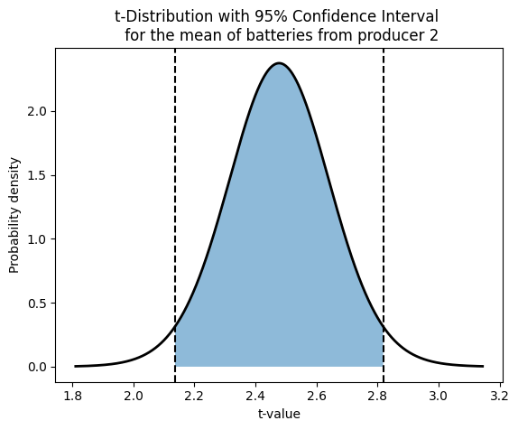

    4. 

            stats.probplot(df1, plot=plt)
            plt.ylabel('Producer 1')
            plt.show()
            print('Skewness = ' + repr(round(stats.skew(df1),4)))
            print('Kurtosis = ' + repr(round(stats.kurtosis(df1),4)))
            fig, ax = plt.subplots()
            df1.plot.kde(ax=ax, legend=False, title='Distribution of mean of Producer 1');

        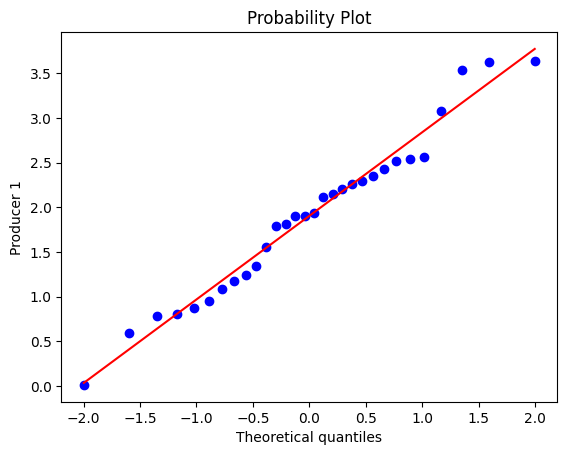

        Skewness = 0.1134

        Kurtosis = -0.4326

        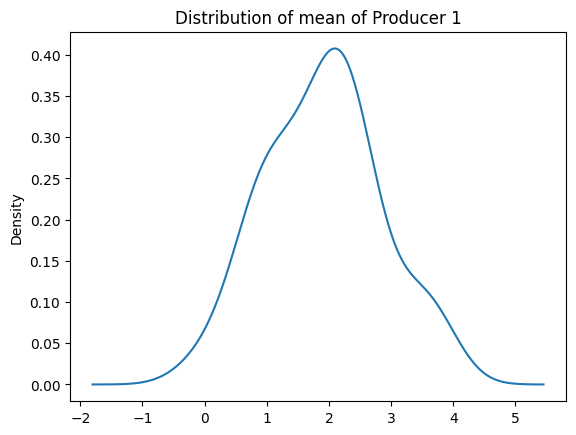

            stats.probplot(df2, plot=plt)
            plt.ylabel('Producer 2')
            plt.show()
            print('Skewness = ' + repr(round(stats.skew(df2),4)))
            print('Kurtosis = ' + repr(round(stats.kurtosis(df2),4)))
            fig, ax = plt.subplots()
            df2.plot.kde(ax=ax, legend=False, title='Distribution of mean of Producer 2');

        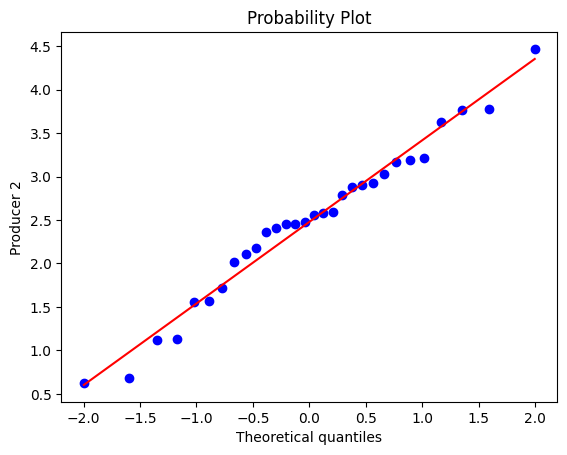

        Skewness = -0.1821

        Kurtosis = -0.19

        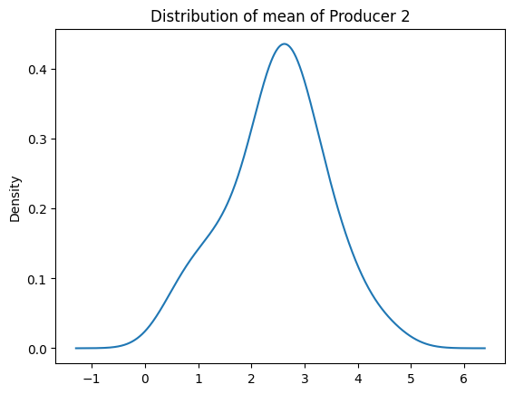

    5. 

            import numpy as np
            import scipy.stats as stats
            import matplotlib.pyplot as plt

            # Generate some sample data for two independent samples (replace this with your own data)
            data1 = df1
            data2 = df2

            # Calculate the mean and standard deviation of the data
            mean1 = np.mean(data1)
            mean2 = np.mean(data2)
            std_dev1 = np.std(data1, ddof=1)  # ddof=1 gives an unbiased estimator of the population std dev
            std_dev2 = np.std(data2, ddof=1)

            # Calculate the standard error of the difference in means
            std_error = np.sqrt((std_dev1 ** 2 / len(data1)) + (std_dev2 ** 2 / len(data2)))

            # Set the significance level and degrees of freedom for the t-distribution
            alpha = 0.05  # 95% confidence level
            df = len(data1) + len(data2) - 2

            # Calculate the critical t-value for the two-tailed t-test
            t_crit = stats.t.ppf(1 - alpha/2, df)

            # Calculate the confidence interval for the difference in means
            diff = mean1 - mean2
            lower = diff - t_crit * std_error
            upper = diff + t_crit * std_error

            # Print the confidence interval
            print("95% Confidence Interval for the Difference in Means: [{:.2f}, {:.2f}]".format(lower, upper))

            # Plot the t-distribution with the rejection region shaded
            x = np.linspace(-4, 4, 1000)
            y = stats.t.pdf(x, df)
            plt.plot(x, y, 'k', linewidth=2)
            shade1 = np.linspace(-t_crit, t_crit, 300)
            plt.fill_between(shade1, stats.t.pdf(shade1, df), alpha=0.5)
            plt.axvline(x=t_crit, linestyle='--', color='k')
            plt.axvline(x=-t_crit, linestyle='--', color='k')
            plt.title("t-Distribution with 95% Confidence Interval for the Difference in Means")
            plt.xlabel("t-value")
            plt.ylabel("Probability density")
            plt.show()

        95% Confidence Interval for the Difference in Means: [-1.05, -0.10]

        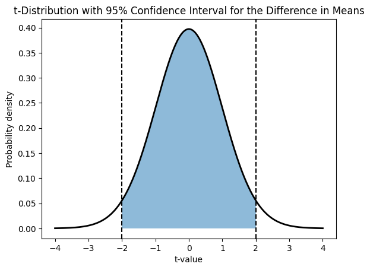

    6. 

            import numpy as np
            import scipy.stats as stats
            import matplotlib.pyplot as plt

            # Generate some sample data for two independent samples (replace this with your own data)
            data1 = df1
            data2 = df2

            # Calculate the mean and standard deviation of the data
            mean1 = np.mean(data1)
            mean2 = np.mean(data2)
            std_dev1 = np.std(data1, ddof=1)  # ddof=1 gives an unbiased estimator of the population std dev
            std_dev2 = np.std(data2, ddof=1)

            # Set the significance level
            alpha = 0.05  # 95% confidence level

            # Perform a two-sample t-test with equal variances
            t_stat, p_value = stats.ttest_ind(data1, data2, equal_var=True)

            # Calculate the critical t-value for the two-tailed t-test
            t_crit = stats.t.ppf(1 - alpha/2, len(data1) + len(data2) - 2)

            # Print the results of the hypothesis test
            if p_value < alpha:
                print("Reject since ", round(p_value, 4), ' < ', alpha)
            else:
                print("Fail to reject since ", round(p_value, 4) , '\u2265' , alpha)

            # Plot the t-distribution with the rejection region shaded
            x = np.linspace(-4, 4, 1000)
            y = stats.t.pdf(x, len(data1) + len(data2) - 2)
            plt.plot(x, y, 'k', linewidth=2)
            shade1 = np.linspace(-t_crit, t_crit, 300)
            shade2 = np.linspace(t_crit, 4, 300)
            plt.fill_between(shade1, stats.t.pdf(shade1, len(data1) + len(data2) - 2), alpha=0.5)
            plt.fill_between(shade2, stats.t.pdf(shade2, len(data1) + len(data2) - 2), alpha=0.5)
            plt.axvline(x=t_crit, linestyle='--', color='k')
            plt.axvline(x=-t_crit, linestyle='--', color='k')

            # Add an arrow pointing to the position on the x-axis where the p-value lies
            if p_value < alpha/2:
                plt.annotate("p = {:.4f}".format(p_value), xy=(t_stat, 0.1), xytext=(t_stat + 1, 0.3),
                            arrowprops=dict(facecolor='green', shrink=0.05))
            elif p_value > 1 - alpha/2:
                plt.annotate("p = {:.4f}".format(p_value), xy=(t_stat, 0.1), xytext=(t_stat - 1, 0.3),
                            arrowprops=dict(facecolor='green', shrink=0.05))
            else:
                plt.annotate("p = {:.4f}".format(p_value), xy=(t_stat, 0.1), xytext=(t_stat, 0.3),
                            arrowprops=dict(facecolor='green', shrink=0.05))

            plt.title("t-Distribution with Hypothesis Test Results")
            plt.xlabel("t-value")
            plt.ylabel("Probability density")
            plt.show()

        Reject since  0.0177  <  0.05

        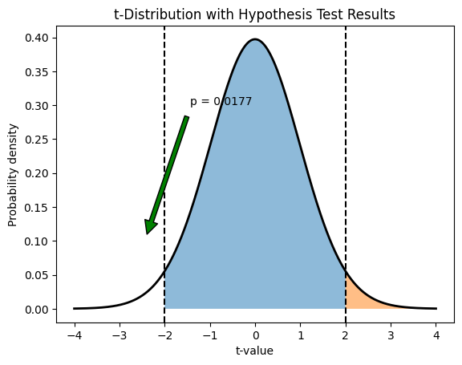

