<h1 align="center">08 Regression</h1>


## Material:

ASPE: 11 (not 11.9)

[Recap notes](https://drive.google.com/file/d/1Qsuum2ke2f8gCUyeP1wcFHkusnbBqSU6/view?usp=sharing)

[Session notes](https://drive.google.com/file/d/1N_hUEd6Hwn93dVtaSWHsFqe9N47E2WRg/view?usp=sharing)

[Session material](https://viaucdk-my.sharepoint.com/:f:/g/personal/rib_viauc_dk/Ev05wEbMShxPn7BZdA0uAncBwWrvATthywVt7NfsbGJo6w?e=GGnrFa)

Session from 20/21: 

<iframe width="560" height="315" src="https://www.youtube.com/embed/XmV8qxDEfkE?si=BPL580E9-aOvoiYk" title="YouTube video player" frameborder="0" allow="accelerometer; autoplay; clipboard-write; encrypted-media; gyroscope; picture-in-picture; web-share" referrerpolicy="strict-origin-when-cross-origin" allowfullscreen></iframe>

---

### Session Description

Linear regression is a statistical method used to model the relationship between a dependent variable and one or more independent variables. The key elements of linear regression include the dependent variable, independent variable(s), regression coefficients, intercept, and residual error. The regression coefficients represent the change in the dependent variable associated with a one-unit change in the independent variable, while the intercept represents the expected value of the dependent variable when all independent variables are equal to zero. The residual error is the difference between the observed values of the dependent variable and the values predicted by the regression model. The goal of linear regression is to find the best-fitting line that minimizes the sum of the squared residual errors. Linear regression is a widely used method in various fields to make predictions or estimate the strength and direction of relationships between variables.

#### Key Concepts
- Least Squares Estimates
- Regression Equation
- Correlation
- Coefficient of determination
- Prediction
- Residual Analysis

I've added a [page](Calculating_metrics.md) with all the useful formulas for calculating the parameters as well as the performance metrics, $r$ and $r^2$

---

### Exercises

<!-- If nothing is noted, assume it is “Exam”. If it is the reexam, it will be stated. -->
<!-- 2020.4 (not f), 2020.5, 2020.6, 2020.7, Reexam 2018.4, Reexam 2018.5, Reexam 2018.6, 2018.6, 2017.4, 2017.5, 2017.6 -->

<style type="text/css">
    ol { list-style-type: lower-alpha; }
</style>

#### Exercise 1 (2020.4)

Hydrocarbon emissions from cars are known to have decreased dramatically during the 2010s. A study was conducted to compare the hydrocarbon emissions at idling speed, in parts per million (ppm), for automobiles from 2010 and 2020. Fifty cars of each model year were randomly selected, and their hydrocarbon emission levels were recorded. The data is displayed in "HydroCarbonEmissions.xlsx".

1. Determine estimates for the quartiles, average emission, standard deviation and variance of each model year.
2. Setup $95 \%$ confidence intervals for the mean of each model year, and accompany the intervals with plots that display the rejection region
3. Is it reasonable to assume that the emission of each model year is normally distributed? Explain using plots and discussing skewness and kurtosis.
4. Setup a $99 \%$ confidence interval for the mean emission difference between the two model years and accompany the intervals with plots that display the rejection region.
5. Is there significant evidence to support the claim that the mean emission difference between the two model years differ from one another?

??? answer
    ```python
    df = pd.read_excel("HydroCarbonEmissions.xlsx")
    df.head()
    ```

    1. 

        ```python
        display(Latex("For 2010 model:"))
        display(Latex("$$Q_1 = {}$$".format(np.percentile(df['2010s models'], 25))))
        display(Latex("$$Q_2 = {}$$".format(np.percentile(df['2010s models'], 50))))
        display(Latex("$$Q_3 = {}$$".format(np.percentile(df['2010s models'], 75))))
        display(Latex("$$\mu = {}$$".format(df['2010s models'].mean())))
        display(Latex("$$\sigma = {}$$".format(round(df['2010s models'].std(ddof=1), 2))))
        display(Latex("$$\sigma^2 = {}$$".format(round(df['2010s models'].var(ddof=1), 2))))

        display(Latex("For 2020 model:"))
        display(Latex("$$Q_1 = {}$$".format(np.percentile(df['2020s models'], 25))))
        display(Latex("$$Q_2 = {}$$".format(np.percentile(df['2020s models'], 50))))
        display(Latex("$$Q_3 = {}$$".format(np.percentile(df['2020s models'], 75))))
        display(Latex("$$\mu = {}$$".format(df['2020s models'].mean())))
        display(Latex("$$\sigma = {}$$".format(round(df['2020s models'].std(ddof=1), 2))))
        display(Latex("$$\sigma^2 = {}$$".format(round(df['2020s models'].var(ddof=1), 2))))
        ```

        For 2010 model: 

        \begin{gathered}
        Q_1=258.0 \\
        Q_2=396.5 \\
        Q_3=506.75 \\
        \mu=391.6 \\
        \sigma=180.95 \\
        \sigma^2=32743.31
        \end{gathered}

        For 2020 model:

        \begin{aligned}
        &Q_1=92.75\\
        &Q_2=201.0\\
        &Q_3=306.0\\
        &\mu=197.44\\
        &\sigma=115.54\\
        &\sigma^2=13349.39
        \end{aligned}

    2. 

        ```python
        n10 = len(df['2010s models'])
        m10 = np.mean(df['2010s models'])
        SE10 = stats.sem(df['2010s models'])
        Level = 0.95

        CI10 = stats.t.interval(Level, n10-1, loc=m10, scale=SE10)

        n20 = len(df['2020s models'])
        m20 = np.mean(df['2020s models'])
        SE20 = stats.sem(df['2020s models'])

        CI20 = stats.t.interval(Level, n20-1, loc=m20, scale=SE20)

        display(Latex('A ' + repr(int(Level*100)) + ' % confidence interval for the sample mean of the 2010 models is ['+
                    repr(round(CI10[0],3)) + ' ; ' + repr(round(CI10[1],3)) + ']'))
        display(Latex('A ' + repr(int(Level*100)) + ' % confidence interval for the sample mean of the 2020 models is ['+
                    repr(round(CI20[0],3)) + ' ; ' + repr(round(CI20[1],3)) + ']'))


        # Confidence interval calculations
        CI10 = stats.norm.interval(0.95, loc=m10, scale=SE10)
        CI20 = stats.norm.interval(0.95, loc=m20, scale=SE20)

        # Plotting
        plt.figure(figsize=(10, 6))
        x10 = np.linspace(m10 - 4*SE10, m10 + 4*SE10, 1000)
        z10 = np.linspace(CI10[0], CI10[1], 1000)
        y10 = stats.norm.pdf(x10, m10, SE10)
        plt.plot(x10, y10, color='blue', label='2010s models PDF')
        plt.fill_between(z10, stats.norm.pdf(z10, m10, SE10), color='blue', alpha=0.5, label='2010s CI')

        x20 = np.linspace(m20 - 4*SE20, m20 + 4*SE20, 1000)
        z20 = np.linspace(CI20[0], CI20[1], 1000)
        y20 = stats.norm.pdf(x20, m20, SE20)
        plt.plot(x20, y20, color='green', label='2020s models PDF')
        plt.fill_between(z20, stats.norm.pdf(z20, m20, SE20), color='green', alpha=0.5, label='2020s CI')

        plt.title('Probability Density Function and Confidence Intervals for 2010s and 2020s Models')
        plt.xlabel('Value')
        plt.ylabel('Probability Density')
        plt.legend()
        plt.grid(True)
        plt.show()
        ```

        A 95 % confidence interval for the sample mean of the 2020 models is [164.604 ; 230.276]

        


#### Exercise 2 (2020.5)

The dataset for this assignment is "Wages_and_Work_Hour.xlsx". This workbook contains data on fulltime workers in East North Central United States from the March 1999 CPS. The objective is to determine whether Education, Income, and Gender differ.

Variable notes:

- Education Level: Group 1 has less than 13 years of education. Group 2 has between 13 and 15 years of education (both included). Group 3 has 16 years or more of education.
- Income Group: Group 1 has less than or equal to $\$ 20,000$ in income. Group 2 has between $\$ 20,000$ and $\$ 48,000$ in income (both included). Group 3 has more than $\$ 48,000$ in income. 

<br>

1. Create a contingency table, placing Gender on the vertical axis and Education Level on the horizontal axis, and test whether gender is independent of level of education.
2. Create a contingency table, placing Gender on the vertical axis and Income Group on the horizontal axis, and test whether gender is independent of income.
3. Create a contingency table, placing Education Level on the vertical axis and Income Group on the horizontal axis, and test whether Education Level is independent of Income Group.

??? answer
    1. 

        Contingency Table 

        | Income Group | 1 | 2 | 3 |
        |--------|--------------------|--------------------|--------------------|
        | Female | 1044           | 727	            | 720            |
        | Male   | 1577           | 922            | 1060           |

        Critical Value: 5.9915  
        Chi-squared Statistic: 8.1127, Degrees of Freedom: 2  
        Expected Frequencies:

        | Gender | Education Level 1 | Education Level 2 | Education Level 3 |
        |--------|--------------------|--------------------|--------------------|
        | Female | 1079.16           | 678.95            | 732.89            |
        | Male   | 1541.84           | 970.05            | 1047.11           |

        Test Conclusion: Reject $H_0$ since p-value $=0.0173<0.05$

    2. 

        Contingency Table 

        | Gender | Income Group 1 | Income Group 2 | Income Group 3 |
        |--------|----------------|----------------|----------------|
        | Female | 957            | 1202           | 332            |
        | Male   | 679            | 1651           | 1229           |

        Critical Value: 5.9915  
        Chi-squared Statistic: 459.1215, Degrees of Freedom: 2  
        Expected Frequencies:

        | Gender | Income Group 1 | Income Group 2 | Income Group 3 |
        |--------|----------------|----------------|----------------|
        | Female | 673.60         | 1174.68        | 642.72         |
        | Male   | 962.40         | 1678.32        | 918.28         |

        Test Conclusion: Reject $H_0$ since p-value $=0.0000<0.05$

    3. 

        Contingency Table

        | Income Group | 1    | 2    | 3    |
        |--------------|------|------|------|
        | Education Level 1 | 1025 | 1279 | 317  |
        | Education Level 2 | 437  | 861  | 351  |
        | Education Level 3 | 174  | 713  | 893  |

        Critical Value: 9.4877  
        Chi-squared Statistic: 980.4959, Degrees of Freedom: 4  

        Expected Frequencies:

        | Income Group | 1         | 2         | 3         |
        |--------------|-----------|-----------|-----------|
        | Education Level 1 | 708.75   | 1235.99  | 676.26   |
        | Education Level 2 | 445.91   | 777.62   | 425.47   |
        | Education Level 3 | 481.34   | 839.40   | 459.27   |

        Test Conclusion: Reject $H_0$ since p-value $=0.0000<0.05$

#### Exercise 3 (2020.6)

State the null and alternative hypotheses to be used in testing the following claims and determine generally where the rejection region is located (i.e. is it a right-, left- or two-tailed test):

1. The mean snowfall at Bygholm during the month of February is 21.8 centimeters.
2. No more than $20 \%$ of the faculty at VIA are competent teachers.
3. On the average, children attend schools within 2.62 kilometres of their homes in Denmark.
4. The proportion of voters favoring the incumbent in the upcoming American election is 0.38 .
5. The average cabbage at the grocery store weighs at least 240 grams (Source: our colleague Jakob Knop Rasmussen).

??? answer
    1. 

        The parameter of interest is the mean snowfall in Bygholm for February.

        $$
        \begin{aligned}
        & H_0: \mu=21.8 \mathrm{~cm} \\
        & H_1: \mu \neq 21.8 \mathrm{~cm}
        \end{aligned}
        $$

        Two-tailed test.

    2. 

        The parameter of interest is the proportion of competent teachers at VIA.

        $$
        \begin{aligned}
        & H_0: p \leq 0.2 \\
        & H_1: p>0.2
        \end{aligned}
        $$

        Right-tailed test.

    3. 

        The parameter of interest is the average school proximity to homes of children.

        $$
        \begin{aligned}
        & H_0: \mu \leq 2.62 \mathrm{~km} \\
        & H_1: \mu>2.62 \mathrm{~km}
        \end{aligned}
        $$

        Right-tailed test.
    
    4. 

        The parameter of interest is the proportion of voters favoring the incumbent in the upcoming American election.

        $$
        \begin{aligned}
        & H_0: p=0.38 \\
        & H_1: p \neq 0.38
        \end{aligned}
        $$

        Two-tailed test.
    
    5. 

        The parameter of interest is the average weight of cabbages at the grocery.

        $$
        \begin{aligned}
        & H_0: \mu \geq 240 g \\
        & H_1: \mu<240 g
        \end{aligned}
        $$


        Left-tailed test.

#### Exercise 4 (2020.7)

A professor in the School of Engineering in a university polled a dozen colleagues about the number of professional meetings they attended in the past five years $(x)$ and the number of papers they submitted to refereed journals $(y)$ during the same period. The summary data are given as follows:

$$
\begin{aligned}
n & =12, \quad \bar{x}=4, \quad \bar{y}=12 \\
\sum_{i=1}^n x_i^2 & =232, \quad \sum_{i=1}^n x_i y_i=318
\end{aligned}
$$


Fit a simple linear regression model between $x$ and $y$ by finding out the estimates of intercept and slope. Hint: Use the Least Squares Estimates formula from the book.

??? answer
    \begin{aligned}
    &\text { From the data summary we get }\\
    &\begin{aligned}
    & \hat{B}_1=\frac{(12)(318)-[(4)(12)][(12)(12)]}{(12)(232)-[(4)(12)]^2}=-6.45 \\
    & \hat{B}_0=12-(-6.45)(4)=37.8
    \end{aligned}
    \end{aligned}

#### Exercise 5 (Reexam 2018.4)

Two producers of batteries measure the longevity of 30 batteries of the same type, which were randomly chosen from a larger batch of such batteries. The lifetime (in hundreds of hours) is displayed "Batteries.xlsx".

1. Check the dataset for outliers and replace any outliers with the mean lifetime of the producer in question. Use this cleaned dataset in the following questions.
2. Determine estimates for the quartiles, average lifetime, standard deviation and variance of each producer's battery
3. Setup $95 \%$ confidence intervals for each mean battery lifetime from the two producers, and accompany the intervals with plots that display the rejection region.
4. Is it reasonable to conclude that the lifetime of the two producer's battery follow a normal distribution? Explain using plots and discussing skewness and kurtosis.
5. Setup a $95 \%$ confidence interval for the difference between the two producer's battery, and accompany the intervals with plots that display the rejection region.
6. Is there significant evidence to support the claim that the mean lifetime of the batteries from the two producers differ from one another?
7. Setup a test to test whether the standard deviations of the two batteries differ significantly.

??? answer
    1. 

        |  | Producer 1 | Producer 2 |
        | :--- | ---: | ---: |
        | 0 | 2.1162 | 1.1259 |
        | 1 | 2.5135 | 3.1725 |
        | 2 | 1.8137 | 2.4492 |
        | 3 | 0.8075 | 3.7766 |
        | 4 | 1.5554 | 4.4673 |

    2. 
        
        Producer 1:

        $$
        \begin{aligned}
        q 1 & =1.1888 \\
        q 2 & =1.9196 \\
        q 3 & =2.4074 \\
        q 4 & =3.637 \\
        & \text { average }=1.9029 \\
        & \text { std }=0.9109 \\
        & \text { std }=0.8298
        \end{aligned}
        $$


        Producer 2:

        $$
        \begin{aligned}
        & q 1=2.0375 \\
        & q 2=2.5158 \\
        & q 3=3.0069 \\
        & q 4=4.4673 \\
        & \text { average }=2.4776 \\
        & \text { std }=0.9124 \\
        & \text { std }=0.8325
        \end{aligned}
        $$


    3. 

        95% Confidence Interval mean Producer 1: [1.56, 2.24]

    4. 

        Producer 1: 

        Skewness = 0.1134 

        Kurtosis = -0.4326        

        Producer 2:

        Skewness = -0.1821

        Kurtosis = -0.19

    5. 

        95% Confidence Interval for the Difference in Means: [-1.05, -0.10]

    6. 

        Reject since  0.0177  <  0.05

    7. 

        Fail to reject the null hypothesis: the standard deviations are not different

        

#### Exercise 6 (Reexam 2018.5)

Data collected in 1960 from the National Cancer Institute provides the per capita numbers of cigarettes sold along with death rates for various forms of cancer (see [Smoking and Cancer.xlsx](SmokingandCancer.xlsx)).

1. Build regression models with cigarettes sold as the independent variable and each of the four cancer types as the dependent variable. Accompany each model with a scatterplot and a trend line as well as confidence intervals for the regression parameters.
2. For each model, inspect the residuals to confirm that the assumptions about normality and non-patterns are met.
3. Which of the four cancer types exhibit the best correlation with cigarettes sold? Assess using the correlation coefficient.
4. In which data pairs is cigarettes sold a good predictor for the type of cancer? Assess using the correlation of determination and interpret the meaning of this number.
5. For the model that has the best correlation, find the predicted value of deaths per 100 k for 40 and 50 cigarettes sold per capita. Feel free to include $95 \%$ prediction intervals to your predictions.

???answer
    1. 
    
        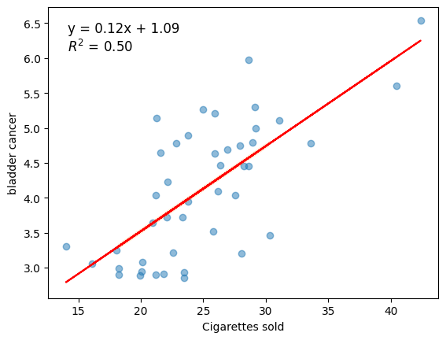
        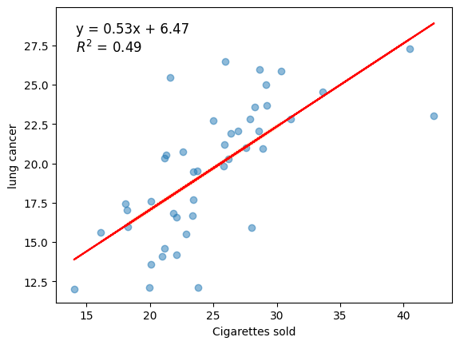  
        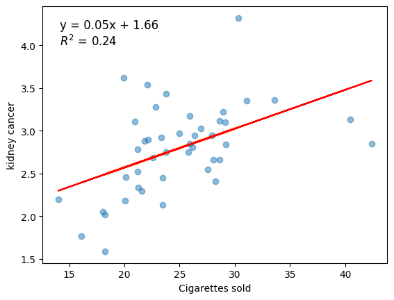
        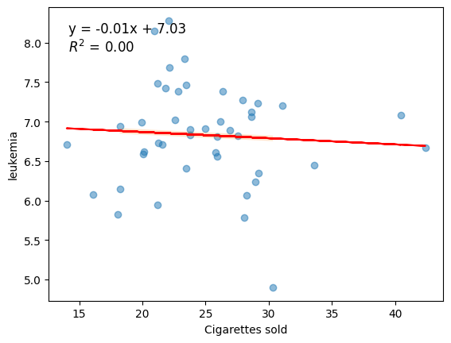  

    2. 

        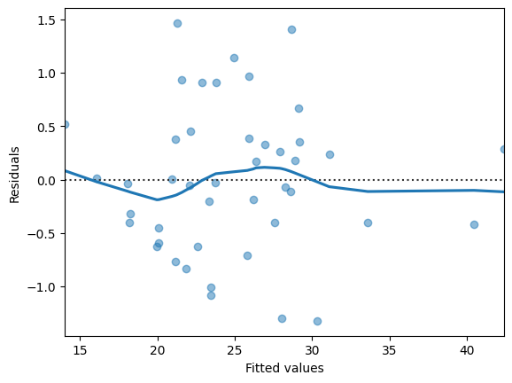
        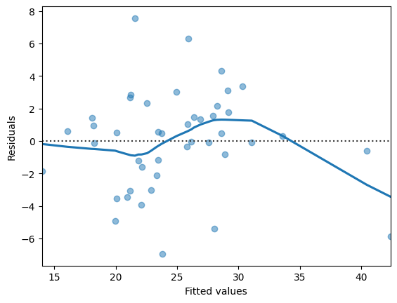  
        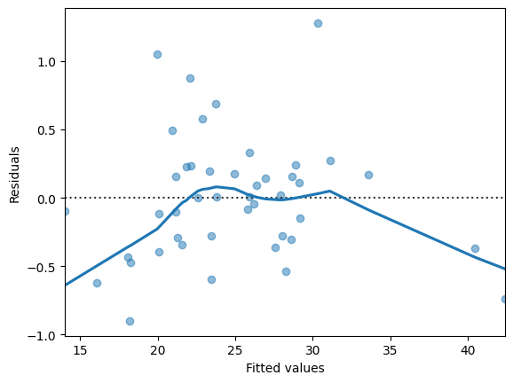
        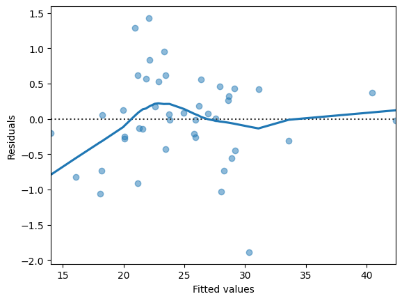  

    3. 

        Correlation coefficient for bladder cancer model: 0.703621859461442

    4. 
    
        Correlation coefficient for bladder cancer model: 0.703621859461442

        R-squared for bladder cancer model: 0.4950837211119772

    5. 

        Bladder cancer rate for cigarette sales of 40: 5.96

        Bladder cancer rate for cigarette sales of 50: 7.18

#### Exercise 7 (Reexam 2018.6)

The dataset for this assignment is the infamous Titanic data set (please see [Titanic.xlsx](Titanic.xlsx)). The objective is to determine whether the survival rates differ between selected variables.

Variable notes:

- pclass: A proxy for socio-economic status
- 1st $=$ Upper
- 2nd $=$ Middle
- 3rd $=$ Lower
- age: Age is fractional if less than 1. If the age is estimated, is it in the form of xx.5
- sibsp: The dataset defines family relations in this way...
- Sibling = brother, sister, stepbrother, stepsister
- Spouse $=$ husband, wife (mistresses and fiancés were ignored)
- parch: The dataset defines family relations in this way...
    - Parent $=$ mother, father
    - Child $=$ daughter, son, stepdaughter, stepson
    - Some children travelled only with a nanny, therefore parch=0 for them.
- alone: is a variable that was created from combining sibsp and parch.

<br>

1. Create a contingency table, placing survived on the vertical axis and pclass on the horizontal axis.
2. Test whether survival rate is independent of pclass.
3. Create a contingency table, placing survived on the vertical axis and sex (gender) on the horizontal axis.
4. Test whether survival rate is independent of sex (gender).
5. Create a contingency table, placing survived on the vertical axis and alone on the horizontal axis.
6. Test whether survival rate is independent of whether a person travelled alone or not.

??? answer

    1. 

        | pclass <br> survived | 1 | 2 | 3 |
        | :--- | ---: | ---: | ---: |
        | 0 | 123 | 158 | 528 |
        | 1 | 200 | 119 | 181 |

    2. 

        Reject the null hypothesis: 'pclass' and 'survived' are not independent

    3. 

        | survived | 0 | 1 |
        | :--- | ---: | ---: |
        | sex |  |  |
        | female | 127 | 339 |
        | male | 682 | 161 |

    4. 

        Reject the null hypothesis: 'sex' and 'survived' are not independent

    5. 

        | survived <br> alone | 0 | 1 |
        | :--- | ---: | ---: |
        | $\theta$ | 258 | 261 |
        | 1 | 551 | 239 |

    6. 

        Reject the null hypothesis: 'alone' and 'survived' are not independent

#### Exercise 8 (2018.6)

The data in [Salary.xlsx](Salary.xlsx) show the (monthly) salary along with years of experience of 31 software developers.

1. Create a complete regression analysis of the data mentioned above. Your analysis must include a plot of the data, considerations about outliers, estimates for the regression parameters and confidence intervals for these, considerations about the assumptions of the model, as well as an assessment of the adequacy of the model.
2. According to the model, what salary can a newly graduated software developer with no experience expect?
3. Assuming the developer starts his/her career at 27 and retires when he/she is 67 , what will be the salary of the developer when he/she retires? Does this sound plausible?

???answer
    1.         

        | OLS Regression Results |  |  |  |  |  |  |
        | :---: | :---: | :---: | :---: | :---: | :---: | :---: |
        | Dep. Variable: |  | Salary | R-sq | uared: | 0.936 |  |
        | Model: |  | OLS | Adj. R-sq | uared: | 0.934 |  |
        | Method: | Least | Squares | F-st | atistic: | 412.4 |  |
        | Date: | Mon, 01 F | eb 2021 Pr | Prob (F-sta | tistic): | $2.72 \mathrm{e}-18$ |  |
        | Time: |  | 14:20:57 L | Log-Likel | ihood: | -296.40 |  |
        | No. Observations: |  | 30 |  | AIC: | 596.8 |  |
        | Df Residuals: |  | 28 |  | BIC: | 599.6 |  |
        | Df Model: |  | 1 |  |  |  |  |
        | Covariance Type: | : nonrobust |  |  |  |  |  |
        |  | coef | std err | t | $\mathrm{P}>\|\mathrm{t}\|$ | [0.025 | 0.975] |
        | const | $2.162 e+04$ | 1921.463 | 11.254 | 0.000 | $1.77 \mathrm{e}+04$ | $2.56 \mathrm{e}+04$ |
        | YearsExperience | 6501.7589 | 320.170 | 20.307 | 0.000 | 5845.921 | 7157.597 |
        | Omnibus: | 4.321 Du | bin-Watson: | n: 1.751 |  |  |  |
        | Prob(Omnibus): | 0.115 Jarq | ue-Bera (JB): | ): 2.044 |  |  |  |
        | Skew: | 0.330 | Prob(JB): | ): 0.360 |  |  |  |
        | Kurtosis: | 1.905 | Cond. No. | o. 13.2 |  |  |  |

        Wrnings:

        [1] Standard Errors assume that the covariance matrix of the errors is correctly specified.

        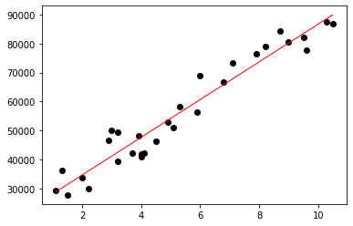

        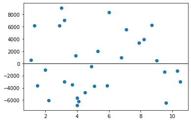

        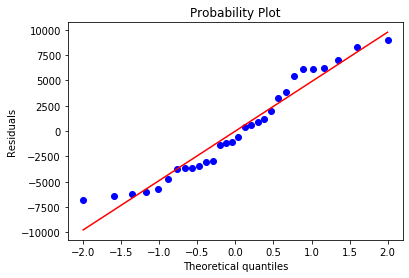        

        Skewness = 0.3305

        Kurtosis = -1.0946

        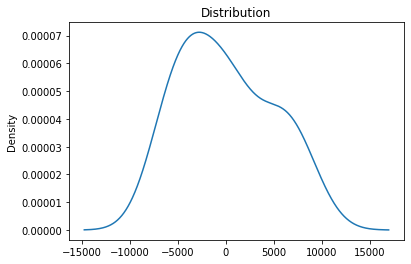

    2. 
    
        A newly employed developer can expect a monthly wage of kr. 21623.65

    3. 

        If a software developer retires after 40 years, he or she will have a wage of kr. 281694.01

        (This sounds very unlikely!)

#### Exercise 9 (2017.4)

An industrial safety program was recently instituted in the computer chip industry. The average weekly loss (averaged over 1 month) in labor-hours due to accidents in 10 similar plants both before and after the program are as follows:
<div class="center-table" markdown>
| Plant | Before | After |
| :--- | :--- | :--- |
| 1 | 30.5 | 23 |
| 2 | 18.5 | 21 |
| 3 | 24.5 | 22 |
| 4 | 32 | 28.5 |
| 5 | 16 | 14.5 |
| 6 | 15 | 15.5 |
| 7 | 23.5 | 24.5 |
| 8 | 25.5 | 21 |
| 9 | 28 | 23.5 |
| 10 | 18 | 16.5 |
</div>

1. Determine whether the safety program has had a significant effect on reducing labor-hours due to accidents in the 10 plants.
2. Is there evidence to support the claim that the program has had an effect at the $1 \%$ level of significance?

???answer

    1. 

        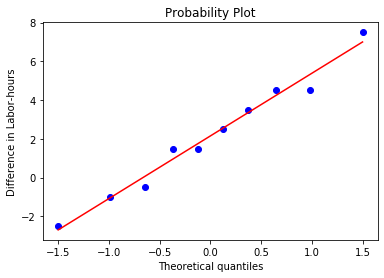

        Skewness = 0.1328

        Kurtosis = -0.7163

        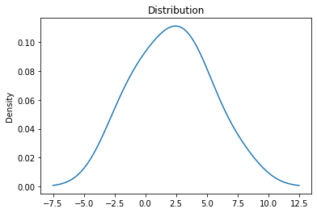
        

        Reject since 0.02485 < 0.05

    2. 

        same p-value different alpha, so no.

#### Exercise 10 (2017.5)

A recent study among 254 computer science graduates from Aarhus University was made in order to determine how successful the former students were in their current employment. 98 of these students had taken a course in linear algebra and of these 92 were classified as "successful" in their current employment. 136 of the students who had not taken a course in linear algebra were classified as "successful" in their current employment.

1. Is the evidence to support the claim that computer science graduates who had taken a linear algebra course were more successful in their current employment than those who had not taken such a course?
2. Explain the meaning of the p-value obtained in question (a), i.e. what does this probability refer to?

???answer

    1. 

        Reject since 0.0432 < 0.05

        Z-Test Results for Two Proportions
        Z-Score: 1.71
        P-Value: 0.0432
        Significance Level (Alpha): 0.05
        Conclusion: Reject the null hypothesis since p-value < alpha.

    2. 

        see other answers elsewhere

#### Exercise 11 (2017.6)

As part of their final project, two ICT students are working on a data warehouse support system. The major workload is the warehouse orders. Thus, the key business metric is identified as number of order lines. The students want to find a method to predict CPU utilization based on the number of order lines entered into the system and have collected 31 samples of CPU utilization and number of order line entries

<div class="center-table" markdown>
| Sample # | CPU Utilisation | Order lines per day |
| :--- | :--- | :--- |
| 1 | 27.01 | 16483 |
| 2 | 32.43 | 13142 |
| 3 | 21.74 | 12015 |
| 4 | 20.56 | 11986 |
| 5 | 2.85 | 1119 |
| 6 | 1.41 | 0 |
| 7 | 1.45 | 0 |
| 8 | 46.38 | 12259 |
| 9 | 21.95 | 6531 |
| 10 | 29.55 | 14086 |
| 11 | 30.04 | 12797 |
| 12 | 28.08 | 13141 |
| 13 | 3.26 | 454 |
| 14 | 1.62 | 1 |
| 15 | 29.41 | 5971 |
| 16 | 40.02 | 10901 |
| 17 | 29.86 | 14271 |
| 18 | 28.34 | 13728 |
| 19 | 34.82 | 12938 |
| 20 | 3.22 | 1158 |
| 21 | 1.43 | 0 |
| 22 | 34.22 | 11450 |
| 23 | 23.58 | 5311 |
| 24 | 33.66 | 17073 |
| 25 | 23.36 | 11336 |
| 26 | 26.76 | 7340 |
| 27 | 4.31 | 11330 |
| 28 | 2.62 | 0 |
| 29 | 33.44 | 10679 |
| 30 | 29.19 | 12803 |
| 31 | 28.11 | 12827 |
</div>

1. Create a complete regression analysis of the data above. Your analysis must include a plot of the data, considerations about outliers, estimates for the regression parameters and confidence intervals for these, considerations about the assumptions of the model, as well as an assessment of the adequacy of the model.

???answer

    1. 

        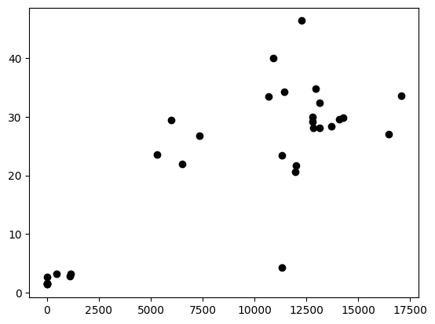

        | OLS Regression Results |  |  |  |  |  |  |
        | :---: | :---: | :---: | :---: | :---: | :---: | :---: |
        | Dep. Variable: |  | Unnan | med: 1 |  | R-squared: | 0.669 |
        | Model: |  |  | OLS | Adj. | squared: | 0.658 |
        | Method: |  | Least Sq | quares |  | F-statistic: | 58.63 |
        | Date: | e: Tue, 27 Nov 2018 |  |  | Prob (F-statistic): |  | 1.92e-08 |
        | Time: |  | 14:45:20 |  | Log-Likelihood: |  | -107.14 |
        | No. Observations: |  | 31 |  | AIC: |  | 218.3 |
        | Df Residuals: |  | 29 |  | BIC: |  | 221.1 |
        | Df Model: |  | 1 |  |  |  |  |
        | Covariance Type | e: nonrobust |  |  |  |  | 0.975] |
        |  | coef | std err | t | $\mathrm{P}>\|\mathrm{t}\|$ | [0.025 |  |
        | const 4. | 6291 | 2.652 | 1.745 | 0.092 | -0.796 | 10.054 |
        | Unnamed: 20. | . 0019 | 0.000 | 7.657 | 0.000 | 0.001 | 0.002 |
        | Omnibus: | 3.065 | Durbin-Watson: |  |  | 1.919 |  |
        | Prob(Omnibus): | 0.216 | Jarque-Bera (JB): |  |  | 2.010 |  |
        | Skew: | 0.000 | Prob(JB): |  |  | $0.366$ |  |
        | Kurtosis: | 4.248 | Cond. No. $\quad 1.95 \mathrm{e}+04$ |  |  |  |  |

        Warnings:

        [1] Standard Errors assume that the covariance matrix of the errors is correctly specified.

        [2] The condition number is large, 1.95e+04. This might indicate that there are
        strong multicollinearity or other numerical problems.

        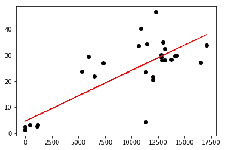
        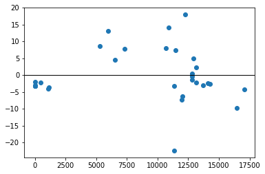
        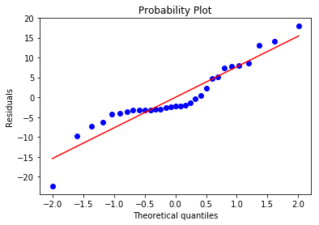

        Skewness = 0.0004

        Kurtosis = 1.2476

        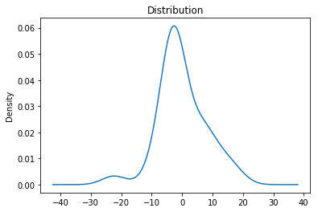