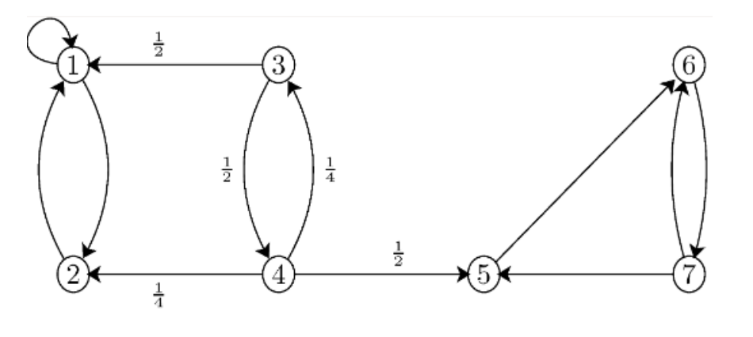
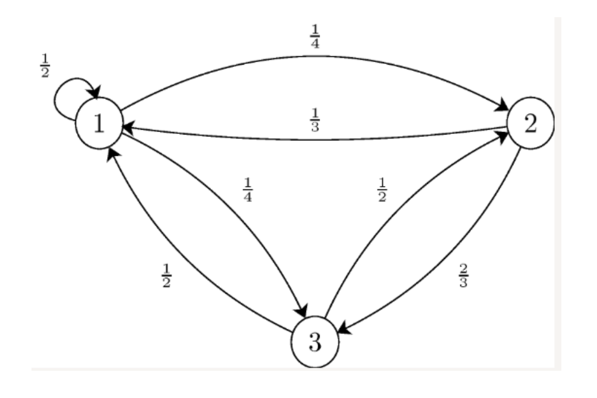
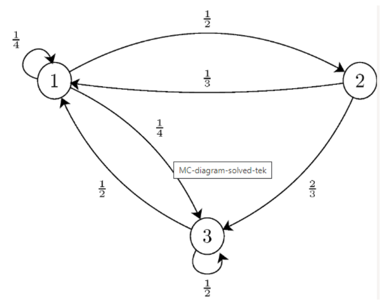

<h1 align="center">10 Markov Chains</h1>

**Material:**

[Recap notes](https://drive.google.com/file/d/1GJYl8qMMGcRZ7FD0qTif7jJazdyUPuQr/view?usp=sharing)

[Session notes](https://drive.google.com/file/d/1AyY6nKHnY9f9Tl9siholsRkop_BbB2Fv/view?usp=sharing)

[Session material](https://viaucdk-my.sharepoint.com/:f:/g/personal/rib_viauc_dk/EuqNIuAYAltDmfXlB9l-DpMBTP5g7G1XrHFCqcXim9OfNQ?e=IMjqf3)

Session from 20/21:
<iframe width="560" height="315" src="https://www.youtube.com/embed/18PY0ogn5yI?si=vUoHRXczrEXGQDIe" title="YouTube video player" frameborder="0" allow="accelerometer; autoplay; clipboard-write; encrypted-media; gyroscope; picture-in-picture; web-share" referrerpolicy="strict-origin-when-cross-origin" allowfullscreen></iframe>

## Topics

Markov chains are a mathematical framework used to model systems that change over time, such as the weather or the stock market. The key feature of a Markov chain is that it assumes that the future state of the system depends only on its current state, and not on any previous states. This is known as the Markov property. Markov chains are defined by a set of states, a transition matrix that describes the probabilities of moving from one state to another, and an initial state. The long-term behavior of a Markov chain can be analyzed using techniques such as finding the stationary distribution or calculating expected values. Markov chains are used in a wide range of applications, including computer science, physics, finance, and biology, among others.

- Markov property: The assumption that the future state of a system depends only on its current state, and not on any previous states.
- State: A possible condition or configuration of the system being modeled.
- Transition matrix: A matrix that describes the probabilities of moving from one state to another.
- Stationary distribution: The long-term distribution of states that a Markov chain approaches over time.
- Expected value: The average value that a variable takes over many iterations of the Markov chain.

## Problems to be worked on in class:

Do Problems 10 and the Wiseflow exam cases covering the final topics.

### Exercise 1

Consider the Markov chain with three states, $S=\{1,2,3\}$, that has the following transition matrix

$$
P=\left[\begin{array}{ccc}
\frac{1}{2} & \frac{1}{4} & \frac{1}{4} \\
\frac{1}{3} & 0 & \frac{2}{3} \\
\frac{1}{2} & \frac{1}{2} & 0
\end{array}\right]
$$

1. Draw the state transition diagram for this chain.
2. If we know $P\left(X_1=1\right)=P\left(X_1=2\right)=\frac{1}{4}$, find $P\left(X_1=3, X_2=2, X_3=1\right)$.

???answer
    <ol start="2">
        <!-- element b -->
        <li style> 1/12 </li>
    </ol>

### Exercise 2

Consider the Markov chain in the figure below. There are two recurrent classes, $R_1=\{1,2\}$, and $R_2=\{5,6,7\}$.

1. Assuming $X_0=3$, find the probability that the chain gets absorbed in $R_1$.
2. Find the expected time (number of steps) until the chain gets absorbed in $R_1$ or $R_2$. More specifically, let $T$ be the absorption time, i.e., the first time the chain visits a state in $R_1$ or $R_2$, so find $E\left[T \mid X_0=3\right]$

???answer
    1. $a_3=\frac{5}{7}$
    2. $t_3=\frac{12}{7}$

### Exercise 3

Consider the following Markov chain

1. Is this chain irreducible?
2. Is this chain aperiodic?
3. Find the stationary distribution for this chain.
4. Is the stationary distribution a limiting distribution for the chain?

???answer
    1. yes
    2. yes
    3. $\pi_1 \approx 0.457, \pi_2 \approx 0.257, \pi_3 \approx 0.286$
    4. yes

### Exercise 4

Consider the following Markov chain

Assume $X_0=1$, and let $R$ be the first time that the chain returns to state 1 . Find $E\left[R \mid X_0=1\right]$.

???answer
    $\frac{8}{3}$